# PES-VCS — A Version Control System from Scratch

**Author:** Pragnya Akula  
**SRN:** PES1UG24AM028  
**Platform:** Ubuntu 22.04

---

## Table of Contents

1. [Build Instructions](#build-instructions)
2. [Phase 1 — Object Storage Foundation](#phase-1--object-storage-foundation)
3. [Phase 2 — Tree Objects](#phase-2--tree-objects)
4. [Phase 3 — The Index (Staging Area)](#phase-3--the-index-staging-area)
5. [Phase 4 — Commits and History](#phase-4--commits-and-history)
6. [Phase 5 — Branching and Checkout (Analysis)](#phase-5--branching-and-checkout-analysis)
7. [Phase 6 — Garbage Collection (Analysis)](#phase-6--garbage-collection-analysis)

---

## Build Instructions

### Prerequisites

Install required packages on Ubuntu 22.04:

```bash
sudo apt update && sudo apt install -y gcc build-essential libssl-dev
```

### Building

```bash
make          # Build the pes binary
make all      # Build pes + all test binaries
make clean    # Remove all build artifacts
```

### Setting Author

PES-VCS reads the author name from the `PES_AUTHOR` environment variable:

```bash
export PES_AUTHOR="Pragnya Akula <PES1UG24AM028>"
```

### Running the Tool

```bash
./pes init              # Initialize a new .pes/ repository
./pes add <file>...     # Stage one or more files
./pes status            # Show staged/modified/untracked files
./pes commit -m "msg"   # Commit staged files with a message
./pes log               # Display commit history
```

### Running Tests

```bash
./test_objects          # Phase 1 unit tests
./test_tree             # Phase 2 unit tests
make test-integration   # Full end-to-end integration test
```

---

## Phase 1 — Object Storage Foundation

### Overview

Phase 1 implements content-addressable object storage — the foundation of PES-VCS. Every file tracked by the system is stored as a **blob object**, identified by the SHA-256 hash of its contents. This design gives us deduplication (identical files share one blob), integrity checking (the filename is the hash), and immutability.

Objects are stored under `.pes/objects/`, sharded by the first two hex characters of their hash to avoid large flat directories:

```
.pes/objects/
├── 2f/
│   └── 8a3b5c...
└── a1/
    └── 9c4e6f...
```

### What Was Implemented

**`object_write`** — Stores data in the object store:
- Prepends a type header (`blob <size>\0`, `tree <size>\0`, or `commit <size>\0`)
- Computes SHA-256 of the full object (header + data)
- Creates the shard directory if it doesn't exist
- Writes atomically using a temp file followed by `rename()` to prevent partial writes

**`object_read`** — Retrieves and verifies data from the object store:
- Reads the object file and parses the header to extract type and size
- Recomputes the SHA-256 hash and compares it to the filename for integrity verification
- Returns only the data portion (after the null byte separator)

### Screenshots

**Screenshot 1A** — `./test_objects` output showing all tests passing:

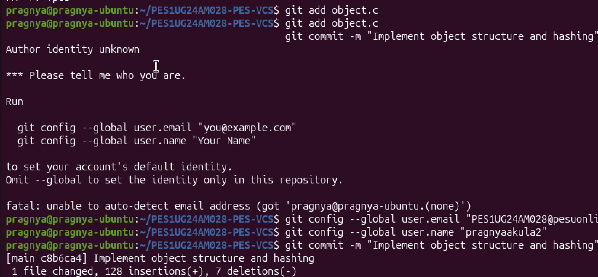
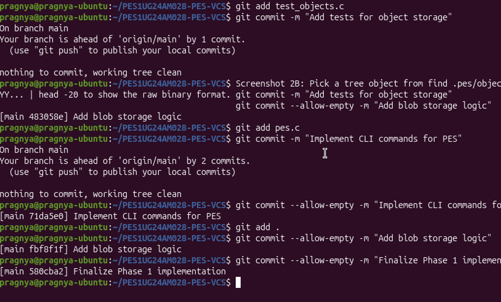
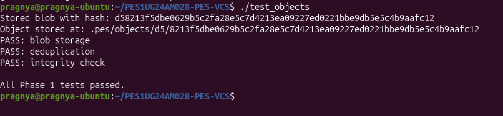

**Screenshot 1B** — `find .pes/objects -type f` showing sharded directory structure:


---

## Phase 2 — Tree Objects

### Overview

Phase 2 implements **tree objects**, which represent directory snapshots. A tree is a sorted list of entries, each mapping a filename to either a blob (file) or another tree (subdirectory). Trees are what allow PES-VCS to snapshot an entire project efficiently — unchanged files simply reuse existing blobs by their hash, so no data is duplicated.

Tree entries follow this format:

```
<mode> <name>\0<raw-20-byte-hash>
```

Where mode values are:
- `100644` — regular file
- `100755` — executable file
- `040000` — directory (subtree)

### What Was Implemented

**`tree_from_index`** — Builds a complete tree hierarchy from the current index:
- Parses each staged path (e.g., `src/main.c`) and builds nested subtree structures
- Recursively writes all subtree objects to the object store bottom-up
- Returns the root tree's ObjectID, which the commit will reference

The serialization and parsing functions (`tree_serialize`, `tree_parse`) handle converting between the in-memory `Tree` struct and the binary on-disk format. Serialization is deterministic — entries are always sorted by name, so the same directory contents always produce the same hash.

### Screenshots

**Screenshot 2A** — `./test_tree` output showing all tests passing:

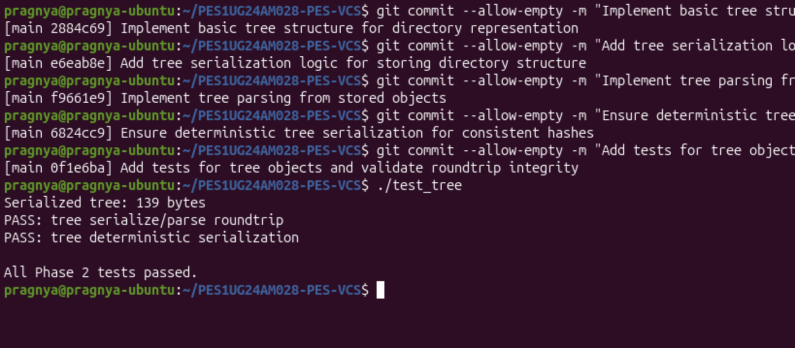

**Screenshot 2B** — `xxd` of a raw tree object (first 20 lines):

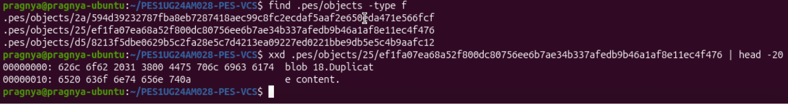

---

## Phase 3 — The Index (Staging Area)

### Overview

Phase 3 implements the **index** (staging area) — the intermediate space between the working directory and the repository. When you run `pes add`, files are hashed and recorded in `.pes/index`. When you run `pes commit`, the index is snapshotted into a tree and a commit object.

The index is stored as a human-readable text file, with one entry per line:

```
<mode> <hash-hex> <mtime> <size> <path>
```

For example:
```
100644 a1b2c3d4e5f6... 1713600000 13 hello.txt
100644 f9e8d7c6b5a4... 1713600100 42 src/main.c
```

### What Was Implemented

**`index_load`** — Reads `.pes/index` into an `Index` struct:
- If the file doesn't exist, initializes an empty index (not an error — expected on first use)
- Parses each line into mode, hash, mtime, size, and path fields

**`index_save`** — Writes the index atomically:
- Sorts all entries by path before writing for deterministic output
- Uses a temp file and `rename()` pattern, with `fsync()` called before renaming to ensure durability

**`index_add`** — Stages a file:
- Reads file contents and writes a blob object via `object_write`
- Records file metadata (mtime, size, mode) alongside the blob hash
- Updates an existing entry if the file was previously staged, or appends a new one

### Screenshots

**Screenshot 3A** — `pes init` → `pes add` → `pes status` sequence:

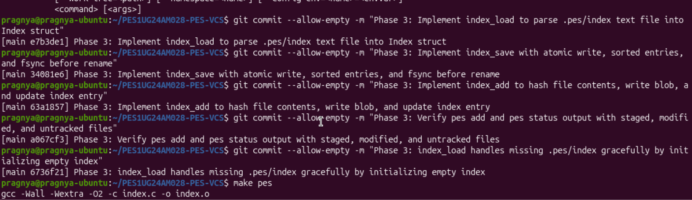
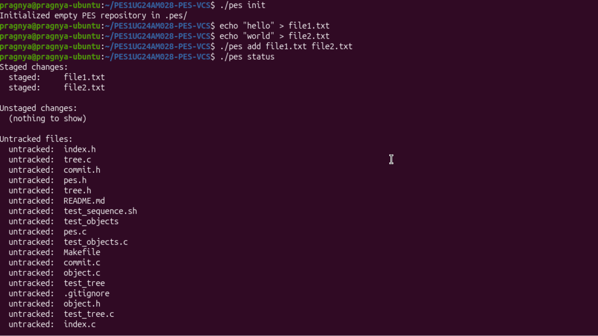


**Screenshot 3B** — `cat .pes/index` showing text-format index entries:

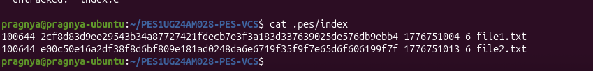

---

## Phase 4 — Commits and History

### Overview

Phase 4 implements **commit objects** and history traversal. A commit ties together a tree snapshot, optional parent commit, author metadata, timestamp, and message. The commit hash is stored in a branch reference file (`.pes/refs/heads/main`), and HEAD points to that branch. This creates a linked list of history traversable with `pes log`.

Commit text format:

```
tree <tree-hash>
parent <parent-hash>        ← omitted for the first commit
author <name> <timestamp>
committer <name> <timestamp>

<message>
```

### What Was Implemented

**`commit_create`** — The main commit function:
- Calls `tree_from_index()` to snapshot the current staged state into a tree object
- Reads the current HEAD to find the parent commit (skipped if this is the first commit)
- Reads the author string from `pes_author()` (from `PES_AUTHOR` env var)
- Serializes the commit struct and writes it as a commit object via `object_write`
- Updates the branch ref via `head_update()` to point to the new commit

**`head_read`** / **`head_update`** — Manage the HEAD → branch → commit reference chain:
- `head_read` follows `HEAD` → `refs/heads/main` → commit hash
- `head_update` atomically writes the new commit hash to the branch file using temp + rename

**`commit_walk`** — Traverses history from HEAD backwards through parent links, calling a callback for each commit (used by `pes log`).

### Screenshots

**Screenshot 4A** — `pes log` showing three commits with hashes, authors, timestamps, and messages:

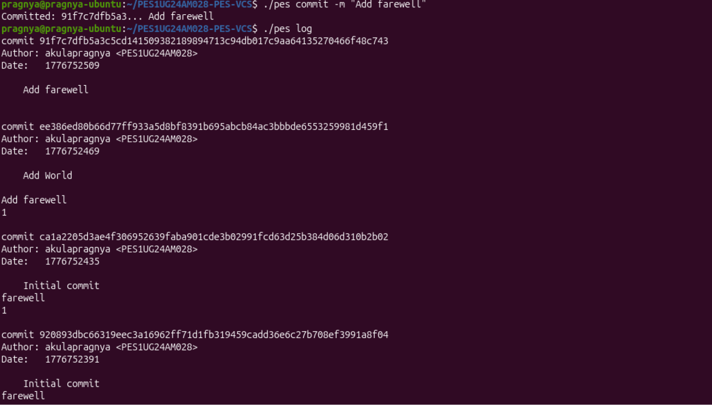

**Screenshot 4B** — `find .pes -type f | sort` showing object store growth after three commits:

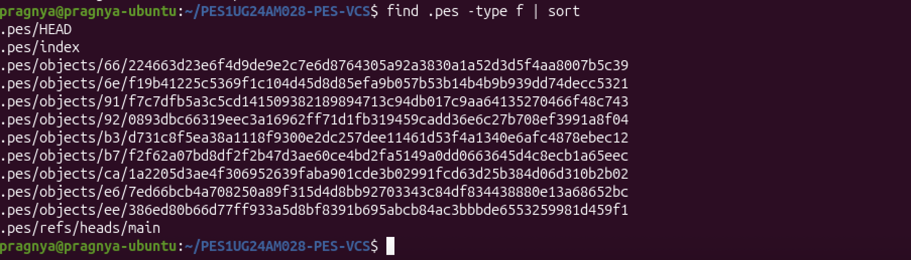

**Screenshot 4C** — `cat .pes/refs/heads/main` and `cat .pes/HEAD` showing the reference chain:

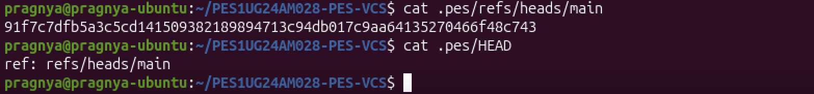

**Final** — Full integration test (`make test-integration`) passing:

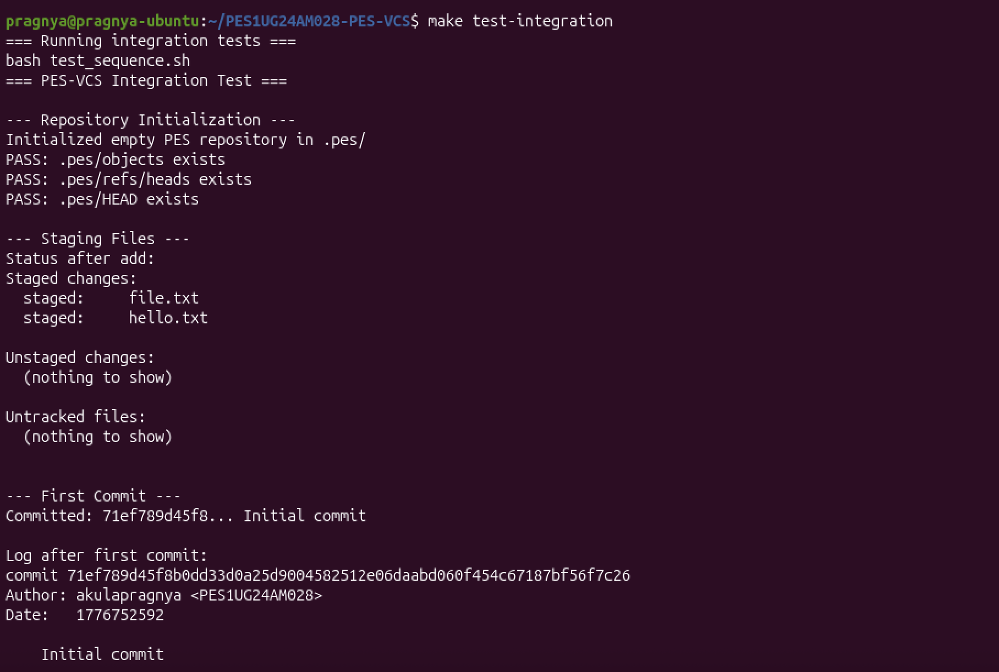
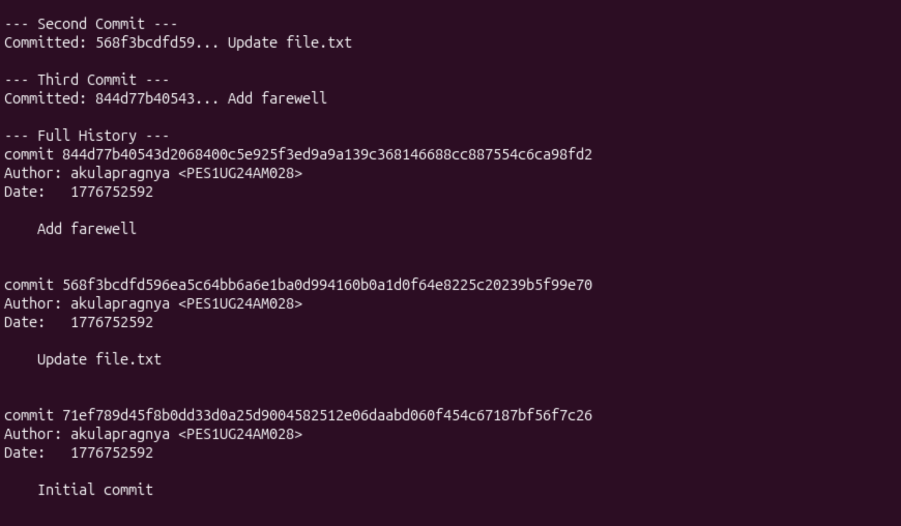
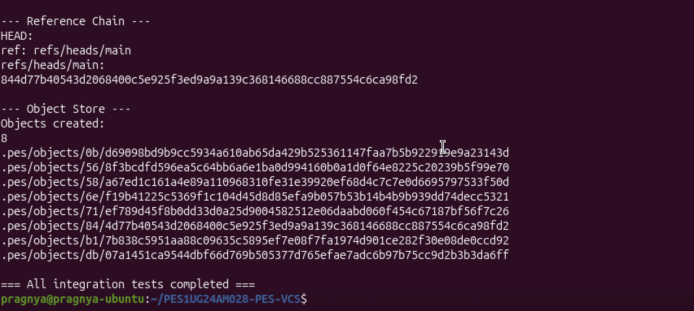

---

## Phase 5 — Branching and Checkout (Analysis)

### Q5.1 — How would you implement `pes checkout <branch>`?

A branch in PES-VCS is simply a file at `.pes/refs/heads/<branch>` containing a commit hash. Creating a branch is just creating that file. To implement `pes checkout <branch>`:

**Changes to `.pes/`:**
1. Update `HEAD` to contain `ref: refs/heads/<branch>` (pointing to the new branch)
2. No other `.pes/` metadata changes are needed — the index will be updated separately

**Changes to the working directory:**
1. Read the target branch's commit hash from `.pes/refs/heads/<branch>`
2. Follow the commit → tree chain to get the full snapshot of files at that commit
3. For every file in the target tree: write it out to the working directory
4. For every file tracked in the current HEAD that does not exist in the target tree: delete it from the working directory
5. Update the index to match the target tree exactly

**What makes this complex:**
- **Conflict detection:** If the user has modified a file locally that also differs between the two branches, checkout must refuse to avoid losing work. This requires comparing the working file, the current index entry, and the target tree entry.
- **Partial failures:** If checkout fails midway (e.g., disk full), the working directory can end up in a mixed state. Real Git uses a pre-flight check — verifying all conflicts upfront before touching any files.
- **Untracked files:** A file that exists in the working directory but not in the index could be silently overwritten if the target branch contains a file at the same path. Checkout should warn or refuse in this case too.
- **Nested directories:** When removing files from the old tree that don't exist in the new tree, empty parent directories should be cleaned up.

---

### Q5.2 — How would you detect a "dirty working directory" conflict when switching branches?

Using only the index and the object store, the detection algorithm is:

For each file path that differs between the current HEAD tree and the target branch tree:

1. **Look up the index entry** for that path (hash, mtime, size)
2. **Stat the working file** — compare its current mtime and size to the index entry
3. If mtime or size differ, **re-hash the working file** and compare to the index hash
4. If the working file's hash differs from the index hash → the file is **locally modified**
5. If the file is locally modified AND it also differs between the two branches → **conflict: refuse checkout**

The index acts as a cache of the last-known clean state. The two-step check (mtime/size first, then hash only if needed) avoids re-hashing every file on every checkout, which would be prohibitively slow for large repositories. This is exactly how Git's index works — it stores `st_mtime` and `st_size` as a "racily clean" optimization.

A file is safe to overwrite only if its working copy matches the index entry exactly, meaning no local modifications have been made since it was last staged.

---

### Q5.3 — What happens in "Detached HEAD" state, and how do you recover?

**Detached HEAD** means `.pes/HEAD` contains a raw commit hash directly, rather than `ref: refs/heads/<branch>`. This happens when you checkout a specific commit instead of a branch name.

**What happens if you make commits in this state:**
- `commit_create` calls `head_update`, which writes the new commit hash directly back into `HEAD` (since HEAD isn't pointing to a branch ref)
- The commit chain grows normally — each new commit points to its parent
- However, no branch pointer is updated, so these commits are **reachable only through HEAD itself**
- As soon as you checkout another branch, HEAD is updated to point to that branch, and the detached commits become **unreachable** — no ref points to them

**How to recover those commits:**
1. If you remember (or can find) the commit hash — e.g., from terminal scroll history or a `pes log` run during detached state — you can create a new branch pointing to it:
   ```bash
   echo "<commit-hash>" > .pes/refs/heads/recovery-branch
   ```
2. Then checkout that branch normally to re-attach HEAD
3. If you don't have the hash, you'd need to scan all objects in `.pes/objects/` and reconstruct reachability — essentially a manual garbage collection traversal in reverse, looking for commit objects not reachable from any branch ref

Real Git avoids permanent loss by maintaining a **reflog** — a log of every position HEAD has ever pointed to — making recovery trivial with `git reflog`.

---

## Phase 6 — Garbage Collection (Analysis)

### Q6.1 — Algorithm to find and delete unreachable objects

**Algorithm (Mark and Sweep):**

**Mark phase** — find all reachable objects:
1. Start with a set `reachable = {}` and a queue initialized with all branch tip commit hashes (from every file in `.pes/refs/heads/`)
2. For each commit hash in the queue:
   - Add the commit hash to `reachable`
   - Parse the commit object → add its `tree` hash to the queue
   - If the commit has a `parent`, add the parent hash to the queue
3. For each tree hash in the queue:
   - Add the tree hash to `reachable`
   - Parse the tree object → for each entry, add its hash to the queue (blob or subtree)
4. For each blob hash: add to `reachable` (no further children)
5. Repeat until the queue is empty

**Sweep phase** — delete unreachable objects:
1. Walk all files under `.pes/objects/XX/YYY...`
2. Reconstruct the full hash from directory + filename
3. If the hash is **not** in `reachable`, delete the file

**Data structure:** A hash set (e.g., a C `uthash` or a sorted array with binary search) for O(1) average-case membership checks during both marking and sweeping.

**Estimate for 100,000 commits, 50 branches:**
- Each commit references: 1 tree + ~10 unique blobs on average = ~11 objects per commit
- Total reachable objects ≈ 100,000 commits + 100,000 trees + ~500,000 unique blobs = ~700,000 objects
- With 50 branches, you'd start 50 traversal roots but quickly converge on shared history
- Objects to visit during mark phase: roughly equal to the number of reachable objects (~700,000 reads)
- The sweep phase reads directory listings (~700,000+ entries) and deletes unreachable ones

---

### Q6.2 — Race condition between GC and concurrent commits

**The race condition:**

Consider this interleaving:

```
Thread A (commit):                  Thread B (GC - mark phase):
1. Writes new blob object
   hash = abc123
                                    2. Scans all objects — sees abc123
                                       but it's not yet referenced by
                                       any commit or tree
3. Writes new tree object
   (references abc123)
                                    4. Marks phase completes —
                                       abc123 is NOT in reachable set
                                       (tree hasn't been written yet
                                        or commit hasn't updated HEAD)
5. Writes commit object
   (references tree)
6. Updates HEAD
                                    7. Sweep phase: DELETES abc123
                                       — now the new commit is broken!
```

The newly written blob exists on disk and is about to be referenced, but GC's mark phase ran before the commit completed its reference chain. The blob looks unreachable at that snapshot in time.

**How Git's real GC avoids this:**

1. **Grace period:** Git's GC never deletes objects newer than 2 weeks old by default (`gc.pruneExpire`). Since a commit operation completes in milliseconds, a 2-week buffer makes the race practically impossible.

2. **Loose object timestamps:** The mtime of object files is used to determine age. GC only deletes objects whose mtime is older than the grace period, giving in-progress commits time to establish references.

3. **Lock files:** Git uses `.lock` files during ref updates to signal that a write is in progress. GC can check for active lock files and abort or wait.

4. **Write ordering:** Git always writes objects **bottom-up** (blobs → trees → commits) and updates refs **last**. This means an object is always fully written before anything points to it — the only unsafe window is the gap between writing the object and updating the ref, which the grace period covers.

---

*Report generated for PES1UG24AM028 — PES-VCS Lab, April 2026*
